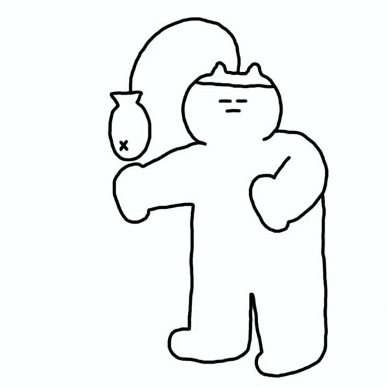

# yren0434_9103_GA
Major Project

**Interactive Features of the Work:**
1. Fish Following the Mouse: When the mouse moves on the canvas, the fish will smoothly follow the position of the mouse.
2. Cat Interaction: Click on the cat's head, and the cat will open its eyes. Click again, and it will close its eyes. Each time you click on the cat, it will make a sound.
3. Bubbles: Press the numerical key "1" on the keyboard, and bubbles of varying sizes and transparency will rise from the bottom of the canvas upwards.
4. Smiley Face/Cat Eyes: Press the numerical key "2" on the keyboard, and a yellow circle in the upper left corner will appear with a smiley face. At the same time, the cat's eyes will widen. 

**The way to drive animation: Interaction**
I chose the interaction method to add animation effects to the code, including the following: the fish following, the cat opening its eyes, the cat making a sound, and the appearance of a smiley face. These animations are triggered by the user's mouse movement/click and key press, which increases the interactivity and interest of the work. 

**Properties of Animated Images:**
1. Bubbles: Their size, position, and transparency are random and they slowly rise.
2. Fish: They follow the mouse and display a smooth swimming effect.
3. Cat: The user's mouse clicks and keystrokes trigger interactions with the cat.
4. Smiley Face: Pressing "2" will display a smiley face. 

*The difference with other group members is that it adds interactivity to the entire code animation, allowing users to generate a fun and childlike animation by clicking or moving the mouse and keyboard.*

**The animation inspiration reference**
My inspiration came from a picture of a cat eating fish, so I wanted to include fish elements in my scene, and the fish should be dynamic. My cat would have some cute actions, so I designed the cat's eye opening and closing and the cat's meowing sound. To make the whole animation more childlike, I also added smiley faces. 

**Technical Specifications:**
1. Bubbles: Bubbles are drawn using the ellipse() method, and their size and transparency are generated randomly using the random() function. The effect of bubbles moving upwards is achieved by controlling the y coordinate.
2. Fish: Fish are smoothly followed by the mouse position using the lerp() function.
3. Cat Interaction: The cat's eyes are opened or closed by clicking the mouse, and the meow sound effect is played using the loadSound() method.
4. Smiley Face: The smiley face is drawn using the ellipse() and arc() methods, and is triggered by pressing a key using the keypressed() function. 

**Regarding changes to the group code:**
In addition to drawing fish and bubbles, changes have been made to the group code, and interactions have been added between fish, bubbles, cats, and smiley faces.